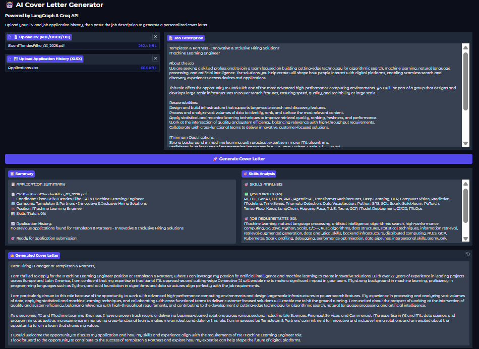
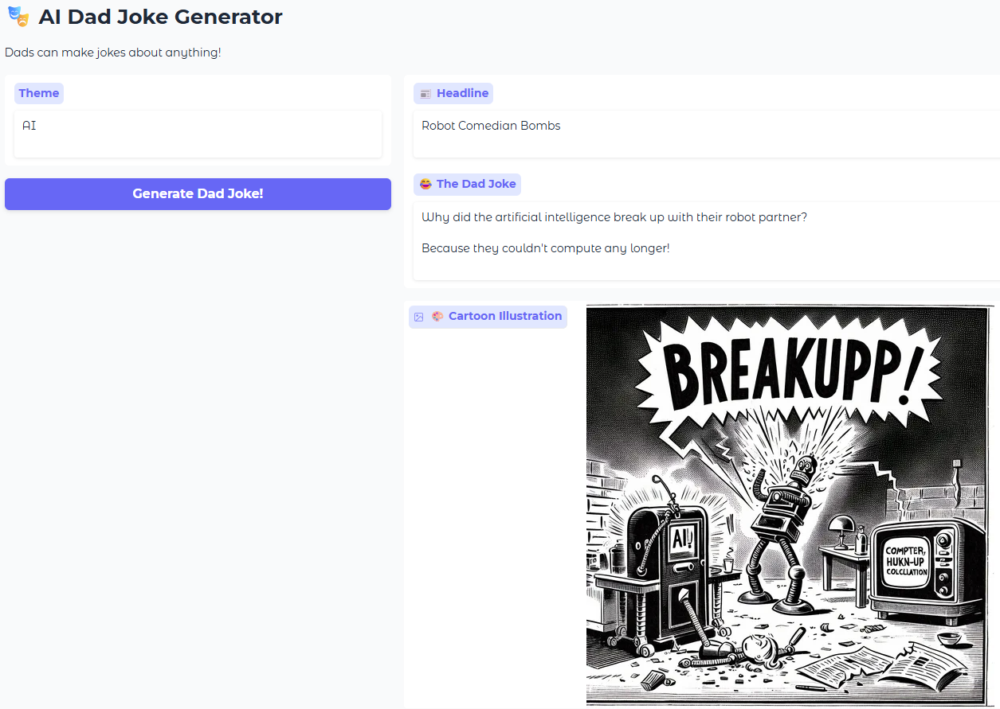

# GenAI

Comprehensive Generative AI and Large Language Models - from fundamentals to production applications.

## Overview

This repository documents my exploration of Generative AI, covering everything from foundational NLP concepts to modern LLM applications. Each notebook represents hands-on implementation of key GenAI techniques.

## Notebooks by Category

### 🎯 Production Applications
- **[AI Cover Letter Generator](notebooks/CoverLetter_AI_LangGraph_v005.ipynb)** - Complete LangGraph application with Gradio UI

- **[AI Dad Jokes Generator](notebooks/Dad_Joke_Generator.ipynb)** - A funny experiment with OpenAi model and Gradio UI

Also deployed at **[Hugging Face Spaces](https://huggingface.co/spaces/PricoTu/dad-joke-generator)** 

- **[Simple ChatBot](notebooks/SimpleChatBot.ipynb)** - Conversational AI implementation
- **[LLMs with RAG and HuggingFace](notebooks/LLMs_RAGandHuggingFace.ipynb)** - Retrieval-augmented generation system

### 🏗️ Transformer Architectures
- **[Self-Attention & Positional Encoding](notebooks/SelfAttention_PositionalEncoding.ipynb)** - Core transformer mechanisms
- **[Transformer for Translation](notebooks/Transformer_for_Translation.ipynb)** - Sequence-to-sequence models
- **[Transformers for Classification](notebooks/Transformers_for_Classification.ipynb)** - Text classification tasks
- **[Decoder-Only Models (GPT)](notebooks/Decoder_Causal_LM_GPT.ipynb)** - Causal language modeling

### 🔧 Fine-Tuning & Training
- **[Fine-Tuning with SFT](notebooks/Fine_Tuning_SFTTransformers.ipynb)** - Supervised fine-tuning
- **[Pre-training BERT](notebooks/PreTrainingBERT.ipynb)** - Masked language modeling
- **[Pre-training LLMs](notebooks/PretrainingLLMs_HuggingFace.ipynb)** - Training from scratch
- **[Reward Modeling](notebooks/Reward_Modeling.ipynb)** - RLHF foundations
- **[Data Prep for BERT](notebooks/DataPrep_for_BERT.ipynb)** - Dataset preparation

### 📚 NLP Fundamentals
- **[Tokenization](notebooks/Tokenization.ipynb)** - BPE, WordPiece, SentencePiece
- **[Word2Vec](notebooks/Word2Vec.ipynb)** - Word embeddings
- **[N-gram Language Models](notebooks/Language_Modelling_With_N_Gram_Analysis.ipynb)** - Statistical language modeling
- **[RNN Translation](notebooks/S_to_S_RNN_Translation.ipynb)** - Sequence-to-sequence with RNNs

### 🛠️ Tools & Infrastructure
- **[HuggingFace Models](notebooks/ModelsWithHuggingFace.ipynb)** - Working with pre-trained models
- **[LangChain Document Loader](notebooks/LangChain_Document_Loader.ipynb)** - Document processing pipelines
- **[NLP Data Loader](notebooks/NLP_DataLoader.ipynb)** - Dataset handling

## Technologies

**Frameworks & Libraries**
- Transformers (HuggingFace)
- LangChain
- LangGraph
- PyTorch
- TensorFlow

**Models**
- BERT, GPT, T5
- Llama, Mistral
- Custom trained models

**Applications**
- RAG systems
- Fine-tuning & PEFT
- Prompt engineering
- Multi-agent systems

## Key Concepts Covered

✅ Transformer architecture and self-attention  
✅ Pre-training vs fine-tuning strategies  
✅ Retrieval-augmented generation (RAG)  
✅ Prompt engineering and optimization  
✅ RLHF and reward modeling  
✅ Production deployment patterns  
✅ Multi-agent LLM systems  

## Related Work

**For broader AI/ML context:**
- [AI-Agents](https://github.com/ElsonFilho/AI-Agents) - Multi-agent systems with crewAI and LangGraph
- [Deep-Learning-Fundamentals](https://github.com/ElsonFilho/Deep-Learning-Fundamentals) - Neural network foundations
- [Python-AI-Applications](https://github.com/ElsonFilho/Python-AI-Applications) - Computer vision and audio processing
- [ML-Fundamentals-Portfolio](https://github.com/ElsonFilho/Python-Machine-Learning-Complete-Guide) - Classical ML algorithms

---

## Context

This repository represents my deep dive into Generative AI and LLMs - the technologies reshaping AI in 2025. Each notebook combines theoretical understanding with practical implementation, suitable for both learning and reference.

**Built with 22+ years of ML experience, now focused on cutting-edge GenAI applications.**

---

*All notebooks created and tested in Google Colab - ready to run.*
